# HALITE Multi-Agent Reinforcement Learning
<code>**Collective Intelligence, Fall 2025**</code>
- Javier Martín Fuentes | **JP4VYS**

---

## Table of Contents

1. [Project Overview](#1-project-overview)
2. [Quick Start](#2-quick-start)
3. [Environment](#3-environment)
   - [3.1 Game Rules](#31-game-rules)
   - [3.2 Implementation](#32-implementation)
   - [3.3 Rewards](#33-rewards)
4. [Rule Based Bot](#4-rule-based-bot)
   - [4.1 Parameter Tuning](#41-parameter-tuning)
   - [4.2 Variants](#42-variants)
   - [4.3 Baseline Evaluation](#43-baseline-evaluation)
5. [MARL Suite](#5-marl-suite)
   - [5.1 Centralized Q-Learning](#51-centralized-q-learning)
   - [5.2 Independent Q-Learning](#52-independent-q-learning)
   - [5.3 IPPO](#53-ippo)
   - [5.4 MAPPO](#54-mappo)
6. [Experiments](#6-experiments)
7. [Conclusions and Further Work](#7-conclusions-and-further-work)
   - [7.1 Conclusions](#71-conclusions)
   - [7.2 Further Work](#72-further-work)

---

### 1. Project Overview

This project implements and compares multiple Multi-Agent Reinforcement Learning (MARL) algorithms on the Halite game environment, a turn-based territorial control strategy game where agents compete for dominance through strategic movement, combat, and resource management. The framework includes a custom Gymnasium-compatible Halite environment with configurable reward functions (supporting minimal, shaped, curriculum-shaped, and production-weighted rewards), a sophisticated rule-based bot baseline with parameter optimization, and four MARL algorithms adapted for local observations: Centralized Q-Learning (CQL), Independent Q-Learning (IQL), Independent Proximal Policy Optimization (IPPO), and Multi-Agent Proximal Policy Optimization (MAPPO). The project conducts comprehensive baseline evaluation with extensive metrics tracking and systematic reward ablation studies. Experimental results demonstrate that MAPPO with shaped rewards achieves the best performance.

---

### 2. Quick Start

#### 2.1 Docker Setup

The project includes a Docker setup with pinned dependencies for reproducible builds.

**Quick Start with Docker:**

```bash
# Build Docker image
docker build -t halite-marl .

# One-liner training
./docker/docker-run.sh train cql
./docker/docker-run.sh train mappo experiment.num_episodes=1000

# One-liner evaluation
./docker/docker-run.sh eval evaluate-model --model-folder models/mappo_98137A
```

**Local Scripts (without Docker):**

```bash
# Training one-liners
./docker/train.sh cql
./docker/train.sh mappo experiment.num_episodes=1000
./docker/train.sh iql device=cuda
./docker/train.sh ippo

# Evaluation one-liner
./docker/eval.sh
```

For detailed Docker usage, see [docker/README.md](docker/README.md).

#### 2.2 Installation

**With Docker (Recommended):**
```bash
docker build -t halite-marl .
```

**Local Installation:**
```bash
# Install pinned dependencies
pip install -r requirements-lock.txt

# Or install with version ranges
pip install -r requirements.txt
```

#### 2.3 Configuration Files

All configurations are managed through Hydra in the `configs/` directory:
- `configs/train/` - Training configurations for each algorithm
- `configs/algo/` - Algorithm-specific hyperparameters
- `configs/env/` - Environment configurations
- `configs/evaluation/` - Evaluation settings
- `configs/experiment/wb/` - Weights & Biases (wandb) configuration

**Wandb Configuration (for saving experiment results):**

To save training metrics and results to Weights & Biases, configure your API key:

1. **Option 1: Edit config file** (recommended)
   - Edit `configs/experiment/wb/api_key.yaml` and add your API key:
   ```yaml
   api_key: "your-wandb-api-key-here"
   project_name: "your-project-name"  # Optional: defaults to "student-halite"
   ```

2. **Option 2: Environment variable**
   - Set the `WANDB_API_KEY` environment variable:
   ```bash
   export WANDB_API_KEY="your-wandb-api-key-here"
   ```

   Get your API key from: https://wandb.ai/authorize

**Note:** If no API key is provided, metrics will still be logged to the console and checkpoints/games will be saved locally, but results won't be synced to wandb.

#### 2.4 Training Scripts

Training scripts are located in `src/training/`:
- `train_cql.py` - Centralized Q-Learning
- `train_iql.py` - Independent Q-Learning
- `train_ippo.py` - Independent PPO
- `train_mappo.py` - Multi-Agent PPO

**Usage:**
```bash
# Direct Python execution
python -m src.training.train_cql
python -m src.training.train_mappo

# With Hydra overrides
python -m src.training.train_cql experiment.num_episodes=1000 device=cuda
```

#### 2.5 Evaluation Procedures

Evaluation can be run using:
```bash
# Direct Python execution
python -m src.eval.evaluate_model --model-folder models/mappo_98137A

# With additional options
python -m src.eval.evaluate_model --model-folder models/mappo_98137A --checkpoint-name ep18000.pt --eval-config configs/evaluation/baseline_evaluation.yaml

# Docker one-liner
./docker/docker-run.sh eval evaluate-model --model-folder models/mappo_98137A
```

#### 2.6 Visualization

Generate replay GIFs and heatmaps from `.hlt` replay files:

```bash
# Direct Python execution
python src/viz/game/visualize_hlt.py outputs/games/mappo_98137A/ep18000.hlt
python src/viz/game/visualize_hlt.py game.hlt --output-dir outputs/visualizations --fps 3

# Docker one-liner
./docker/docker-run.sh python src/viz/game/visualize_hlt.py outputs/games/mappo_98137A/ep18000.hlt
```

**Official Halite Visualizer**

The official Halite visualizer is included in `src/viz/game/official_visualizer/` and provides an interactive web-based interface for viewing `.hlt` replay files. To use it:

1. **Web Browser (Recommended)**: Simply open `src/viz/game/official_visualizer/visualizer/index.html` in your web browser:
   ```bash
   # On macOS
   open src/viz/game/official_visualizer/visualizer/index.html
   
   # On Linux
   xdg-open src/viz/game/official_visualizer/visualizer/index.html
   
   # Or navigate to the file in your file browser and open it with any web browser
   ```

Once opened, drag and drop or select a `.hlt` replay file to visualize the game with interactive controls for play/pause, frame navigation, and detailed game state information.

#### 2.7 Dependencies

- **Pinned versions**: See `requirements-lock.txt` for exact versions used
- **Version ranges**: See `requirements.txt` for minimum version requirements
- **Key dependencies**: PyTorch, Gymnasium, Hydra, WandB, NumPy, SciPy

---

### 3. Environment

Halite is a turn-based, multi-agent strategy game played on a rectangular grid where agents compete for territorial control through strategic movement and combat.

#### 3.1 Game Rules

**Game Board**
- The game is played on a rectangular grid with configurable dimensions (default: 20×20)
- Each cell has two key properties: **strength** (0-255) and **production** (0-255)
- The grid wraps around at the edges (toroidal topology)
- Cells can be owned by players or remain neutral (unowned)

**Actions**
Each piece controlled by an agent can perform one of five actions per turn:
- `STILL` (0): Remain in place and gain strength
- `NORTH` (1): Move one cell upward
- `EAST` (2): Move one cell right
- `SOUTH` (3): Move one cell downward
- `WEST` (4): Move one cell left

**Strength and Production**
- When a piece chooses `STILL`, it permanently increases its strength by the production value of the cell it occupies
- Strength values are capped at 255
- Production values are fixed per cell and remain constant throughout the game

**Combat and Territory**
- Moving a piece off a cell leaves behind a new piece (same owner, strength 0), enabling territory expansion
- Multiple friendly pieces moving to the same cell combine their strengths (capped at 255)
- Combat occurs when enemy pieces occupy the same cell or are cardinally adjacent; each piece deals damage equal to its strength to all adjacent/coinciding enemies simultaneously
- Pieces with strength ≤ 0 after combat are removed (except non-combat pieces with strength 0)
- **Overkill**: A piece can damage multiple enemies simultaneously, potentially dealing more total damage than its strength when destroyed mid-attack

**Turn Resolution**
The game proceeds in the following order each turn:
1. All agents receive the current game state
2. All agents submit their actions simultaneously
3. Strength is added to pieces that chose `STILL`
4. All pieces move and combine (if necessary)
5. Combat damage is calculated and applied simultaneously
6. Pieces with zero or negative strength are removed
7. Ownership is updated based on surviving pieces
8. Game termination conditions are checked

**Game End and Scoring**
- Game ends when only one player remains or the turn limit (`10 × √(width × height)`) is reached
- Players are ranked by elimination order (last standing wins); if the turn limit is reached, ranking is by total territory owned
- Ties are broken using the full territory integral

#### 3.2 Implementation

The Halite environment has been implemented using the **Gymnasium** library, following the standard Gymnasium interface with `reset()` and `step()` methods.

**`reset(seed=None, options=None)`**
- Initializes a new game episode by generating a fresh game state
- Takes an optional `seed` parameter for reproducibility
- Uses a generator to create the initial map with production values and initial agent placements
- Returns a tuple `(observation, info)` where:
  - `observation` is a dictionary containing:
    - `grid`: The game grid with shape `[3, height, width]` representing ownership, strength, and production channels
    - `step_count`: Current turn number (0 at reset)
    - `action_mask`: Boolean mask indicating valid actions for each agent at each cell
  - `info`: Additional information dictionary

**`step(action)`**
- Advances the game by one turn based on the provided actions
- Takes `action` as a numpy array of shape `[num_agents, height, width]` with action values (0=STILL, 1=UP, 2=RIGHT, 3=DOWN, 4=LEFT)
- Processes moves, applies combat damage, updates ownership, and checks game termination
- Returns a tuple `(observation, reward, terminated, truncated, info)` where:
  - `observation`: Updated observation dictionary
  - `reward`: Array of rewards for each agent based on the configured reward function
  - `terminated`: Boolean indicating if the episode has ended (game over conditions met)
  - `truncated`: Always `False`
  - `info`: Additional information dictionary

#### 3.3 Rewards

The Halite environment supports multiple plug-in reward functions that provide different learning signals for training agents. Rewards are computed at each step based on state transitions and actions, and returned as an array with one value per agent.

**Basic Reward Functions:**

- **`MinimalReward`**: Provides sparse rewards only at game end. The winner receives +1 at the end and the rest of agents receive 0 during the game. 

- **`TerritoryRewardFn`**: Rewards agents based on the change in the number of cells they control. The reward is the difference between the number of owned cells in the current state and the previous state. Positive values indicate territory expansion, negative values indicate territory loss.

- **`StrengthRewardFn`**: Rewards agents based on changes in the total strength of pieces in their controlled territory. The reward is computed as the difference in sum of strength values across all owned cells.

- **`ProductionRewardFn`**: Rewards agents based on changes in the total production value of cells they control.

**Advanced Reward Functions:**

- **`ProductionWeightedTerritoryRewardFn`**: Rewards territory changes weighted by the production value of each cell. Instead of counting all cells equally, cells with higher production contribute more to the reward. Gains are weighted by production (positive reward), and losses are weighted by production (negative reward). Supports normalization to a target range (default: [-5, 5]) for training stability.

- **`ShapedRewardFn`**: A composite reward function that combines multiple signals for improved learning. It integrates:
  - Territory rewards (weighted, default: 1.0)
  - Strength rewards (weighted, default: 0.05)
  - Production rewards (weighted, default: 0.3)
  - Expansion bonus for capturing high-production cells (default: 0.5)
  - Asymmetric loss penalty (territory losses penalized 1.5× more than gains)
  - Zero-strength move penalty to discourage wasteful moves (default: 0.1)
  - Optional normalization by grid size to keep rewards in a stable range

- **`CurriculumShapedRewardFn`**: Implements curriculum learning by blending shaped and minimal rewards over time. The reward is computed as:
  ```
  R_t = w(t) · R_shaped + (1 - w(t)) · R_minimal
  ```
  where `w(t)` decreases from 1.0 (early training) to 0.0 (late training) according to a schedule. Supports multiple schedule types (linear, exponential, cosine, step) with configurable start/end episodes.

---

### 4. Rule Based Bot

The Rule Based Bot is a heuristic agent that uses decision rules. It operates in two phases: first collecting proposed moves, then resolving conflicts to produce final actions.  For a detailed explanation of the full decision tree and implementation, see the [README in the bots directory](src/bots/README.md).

**Key Mechanisms**

- **Expansion Thresholding**
The bot uses a dynamic strength threshold system to control when cells can move. The required strength for movement increases with distance from the frontier (border cells): `required_strength = base_strength + scale × (max_distance - cell_distance)`. This creates a gradient where inner cells need more strength to move than border cells.

- **Border Pressure:**
The bot identifies frontier cells (cells adjacent to non-owned territory) and computes a distance map from each cell to the nearest frontier using breadth-first search. This allows the bot to prioritize moving forces toward borders and enemies. Border cells can move with lower strength thresholds, enabling rapid response to enemy advances and territorial opportunities.

- **Regroup/Hold Logic**
Cells that don't meet the movement threshold attempt to combine forces with adjacent non-moving neighbors. The combine-forces mechanism allows multiple cells to merge their strength, enabling inner cells to reach the required threshold for movement. Cells that cannot combine and are not strong enough to move will remain still (STILL action), allowing them to accumulate strength through production.

- **Anti-Collision and Pathing**
The bot implements a sophisticated conflict resolution system to handle movement collisions. In the second phase, it resolves three types of conflicts: (1) multiple cells targeting the same destination (prioritizes stronger cells), (2) position swaps where two cells try to move to each other's positions (breaks the swap favoring the stronger cell), and (3) moves targeting cells that are also moving (cancels the move if the target is already committed). This ensures valid, collision-free movement patterns. Pathfinding toward enemies and high-production zones is done by searching in each direction and scoring based on normalized production values and enemy distances, weighted by a `production_enemy_preference` parameter (0 = prioritize enemies, 1 = prioritize production).

#### 4.1 Parameter Tuning

A grid search was performed to optimize the Rule Based Bot's key hyperparameters: `base_strength` and `production_enemy_preference`. The search evaluated all combinations across a parameter grid:
- **`base_strength`**: Range from 20 to 220 in increments of 20
- **`production_enemy_preference`**: Range from 0.0 to 1.0 in increments of 0.1

Each parameter combination was evaluated over 100 episodes against randomly configured opponents sampled from the same parameter ranges. The evaluation was performed on a 20×20 grid with 4 agents (1 test bot + 3 opponents).

**Grid Search Results**

The grid search revealed that optimal performance is achieved with `base_strength=60` and `production_enemy_preference=0.9`, achieving a win rate of **0.530**. Key findings include:

- Higher win rates (green to yellow in the heatmap) are concentrated in the region where `base_strength` is between 40-80 and `production_enemy_preference` is between 0.4-0.9
- Very high `base_strength` values (180-220) result in poor performance across all production preferences, likely because they prevent timely movement and expansion
- AA balanced approach between enemy targeting and production prioritization is beneficial
- The best configuration shows a strong preference for production (0.9) while maintaining some enemy awareness (0.1), combined with moderate base strength (60)

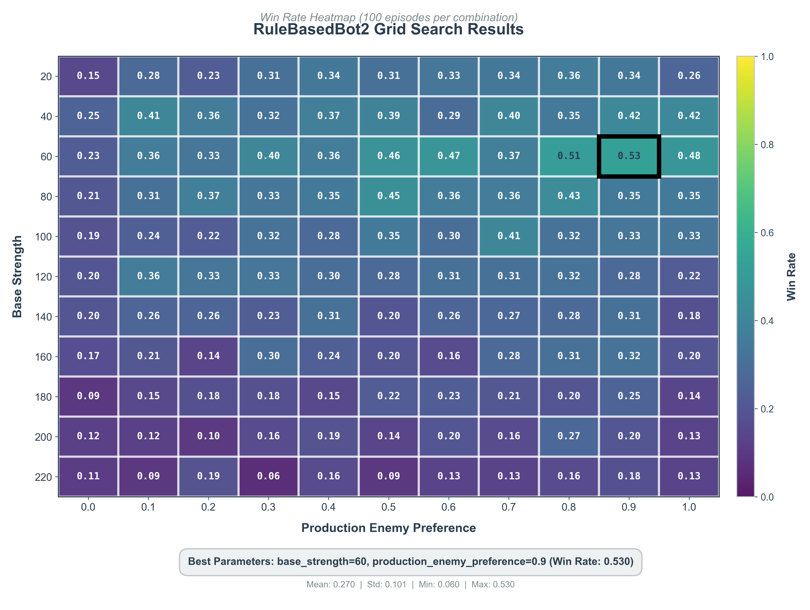

#### 4.2 Variants

Two simplified variants of the Rule Based Bot were developed:

- **`RuleBasedV1`**: A minimal baseline variant with simple decision rules. The bot attacks adjacent enemies when it has greater strength. For all other cells (including inner cells), if they have sufficient strength (≥40), they move in a random direction. This aggressive random movement strategy provides continuous pressure but lacks strategic direction, as inner cells move randomly without considering production values, enemy positions, or territorial boundaries.

- **`RuleBasedV2`**: A production-focused variant that prioritizes expansion into high-production zones. It uses lower strength thresholds (`base_strength=30`, `scale=5`) for faster, more aggressive movement. The bot first attacks weak adjacent enemies (requiring 1.5× strength advantage), then expands into high-production neutral cells (production threshold ≥0.6), and finally moves frontier cells toward high-production areas. Unlike the main RuleBasedBot, it does not implement force combination or dynamic threshold scaling based on distance to frontier, making it simpler but less strategically coordinated.

#### 4.3 Baseline Evaluation

The baseline evaluation framework provides a standardized way to assess the performance of trained agents against established bot opponents. The evaluation runs multiple episodes (typically 10 per opponent type) and computes comprehensive metrics to analyze agent capabilities.

**Evaluation Process**

The evaluation system runs episodes in parallel for efficiency, testing the agent (agent_id=0) against specified opponent bot classes. By default, agents are evaluated against `RandomBot` (all actions are random) and `RuleBasedBot` and its variants, providing both a minimal performance floor and a challenging strategic opponent. Each episode uses independent random seeds to ensure statistical validity, and games run until termination.

**Comprehensive Metrics**

The evaluation computes the following metrics to provide a holistic assessment of agent performance (some are only stored in W&B):

- **Win Rates**: Global win rate across all episodes, and per-opponent win rates to identify which opponents are most challenging
- **Average Position**: Mean final ranking (1-indexed: 1st, 2nd, 3rd, etc.) across all episodes
- **Time Lasted**: Statistics on episode length (average, max, min, standard deviation), indicating survival capability
- **Territory Control**: Maximum territory achieved per episode (average and standard deviation), measuring expansion success
- **Strength Management**: Maximum total strength achieved (average and standard deviation), indicating force accumulation
- **Production Efficiency**: Maximum production value controlled (average and standard deviation), measuring strategic positioning
- **Cap Losses**: Final captured cell losses (average, max, min, std), quantifying defensive vulnerability
- **Frontier Length**: Length of the territorial border (cells adjacent to non-owned territory), indicating expansion and border dynamics over time
- **Engagement Efficiency**: Ratio of territory gained to strength traded in combat, measuring combat efficiency and resource utilization

**Example Results**

The following dashboard shows example baseline evaluation results for the Rule Based Bot, demonstrating the comprehensive metrics visualization:

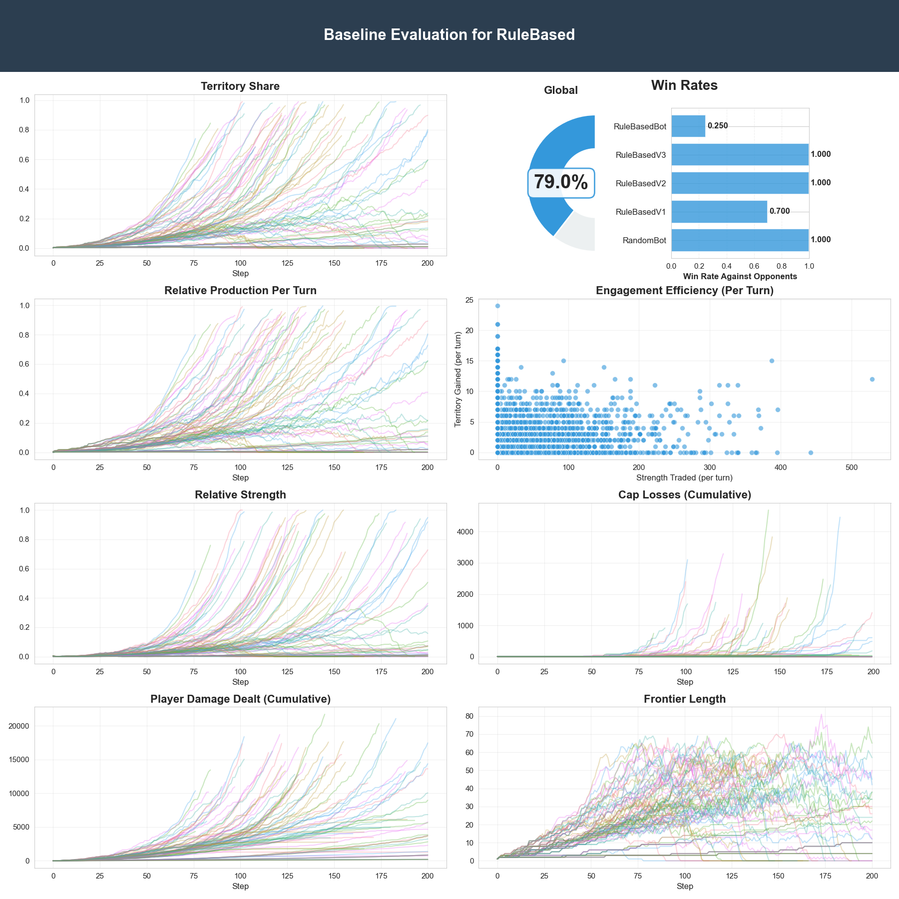

*Baseline evaluation dashboard showing win rates against different opponents, time-series plots of territory share, production, strength, damage dealt, cap losses, and frontier length over game steps, and engagement efficiency scatter plots.*

The following game replay demonstrates the different bot behaviors in action and highlights the superiority of the Rule Based Bot compared to learned agents:

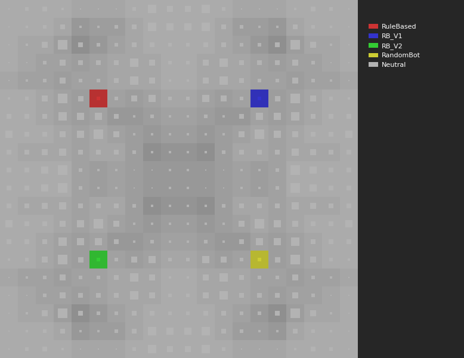

---

### 5. MARL Suite

All algorithms in the MARL suite have been modified to use **local observations** instead of global observations. Each agent's units process 7×7 local patches centered around their position, with 6 feature channels: ownership (is_mine, is_enemy, is_neutral), normalized strength, normalized production, and a unit position mask. This local observation approach provides several advantages: it reduces computational complexity, enables better scalability to larger grids, encourages local coordination strategies, and mimics real-world scenarios where agents have limited field of view.

#### 5.1 Centralized Q-Learning

Centralized Q-Learning (CQL) uses a **joint-state centralized critic** that estimates Q-values for joint state-action pairs across all agents. The Q-network processes local 7×7 patches from all agents' units simultaneously, learning a centralized value function that considers the full multi-agent state. During training, the centralized critic uses information from all agents to compute joint Q-values, enabling coordinated value estimation. However, action selection remains decentralized: each agent's units select actions based on their local observations using an epsilon-greedy policy. This algorithm uses off-policy learning with experience replay and target networks for stable training. The centralized value function can help agents learn coordinated strategies, but requires full state information during training.

#### 5.2 Independent Q-Learning

Independent Q-Learning (IQL) treats each agent as an independent learner with its own Q-network. Each agent learns a separate value function based on its local observations, ignoring the presence of other agents in its value estimates. The algorithm supports two modes: **shared network** mode where all agents share the same Q-network weights (parameter sharing for improved sample efficiency), or **independent networks** mode where each agent maintains its own Q-network. Each agent uses epsilon-greedy exploration and maintains its own experience replay buffer. IQL is fully decentralized and does not require communication between agents, making it simple and scalable. However, the non-stationarity introduced by multiple learning agents can make convergence challenging. The algorithm uses local 7×7 patches for each agent's units and standard DQN techniques (target networks, experience replay) for stable learning.

#### 5.3 IPPO

Independent Proximal Policy Optimization (IPPO) extends the single-agent PPO algorithm to multi-agent settings by treating each agent independently. Each agent maintains its own **actor-critic pair**: the actor uses local 7×7 observations to select actions, while the critic uses global state observations to estimate values. The algorithm supports both **shared weights** (parameter sharing across agents) and **independent networks** (separate networks per agent). IPPO uses on-policy learning with episode buffers, Proximal Policy Optimization clipping for stable policy updates, Generalized Advantage Estimation (GAE) for advantage computation, and multiple update epochs per episode. Each agent's actor processes local patches for decentralized action selection, while critics use global state for value estimation. The algorithm maintains separate episode buffers for each agent, enabling independent learning while benefiting from PPO's stable policy gradient updates.

#### 5.4 MAPPO

Multi-Agent Proximal Policy Optimization (MAPPO) combines centralized training with decentralized execution. The algorithm uses **decentralized actors** that process local 7×7 observations for action selection, but a **centralized critic** that sees the global state and outputs value estimates for all agents. During training, the centralized critic provides value estimates that consider the full multi-agent state, helping agents learn coordinated strategies. However, during execution, agents only need their local observations to select actions. MAPPO supports **shared actor** weights (parameter sharing) or independent actor networks per agent. The algorithm uses on-policy learning with a single centralized episode buffer, PPO clipping, GAE for advantages, and multiple update epochs. The centralized value function can improve learning efficiency by providing better value estimates, while the decentralized actors ensure scalability and practicality during deployment. This hybrid approach balances the benefits of centralized learning with the requirements of decentralized execution.

---

### 6. Experiments

#### 6.1 Resource Availability

All training experiments were conducted on the **MIT Engaging Cluster** using H200 GPUs. The cluster configuration allowed running two training jobs simultaneously, each with a time limit of 6 hours and access to 4 CPU cores. This resource allocation, while sufficient for initial experiments, is not optimal for these types of multi-agent reinforcement learning algorithms, which typically require significantly more training time to reach the desired number of episodes and achieve convergence. The limited time budget constrained the number of episodes that could be completed per run, potentially impacting the final performance of the trained agents.

#### 6.2 Configurations

All experiments use **Hydra** for configuration management, providing a flexible and reproducible framework for managing hyperparameters, environment settings, training, evaluation and algorithm-specific parameters.

**Environment Settings:**
- All algorithms were trained with **4 players** (agents) per game
- Grid size: **20×20** for IQL, IPPO, and MAPPO
- Grid size: **12×12** for CQL

#### 6.3 Monitoring

All training runs were monitored and logged using **Weights & Biases (W&B)**. The W&B project tracks comprehensive metrics throughout training, including:

- **Training Losses**: Algorithm-specific losses (Q-losses for value-based methods, actor/critic losses for policy gradient methods)
- **Rewards**: Episode rewards, cumulative rewards, and per-agent reward statistics
- **Baseline Evaluation Results**: Periodic evaluation metrics against baseline opponents, including win rates, territory control, and engagement efficiency

In addition to metric logging, the training pipeline implements periodic checkpointing and sample game saving locally:

- **Checkpoints**: Model checkpoints are saved at regular intervals (configurable via `save_frequency`), allowing training to be resumed from specific points
- **Sample Games**: Game replay files (`.hlt` format) are saved alongside checkpoints, enabling visual inspection of agent behavior at different training stages


#### 6.4 Results

The experimental results presented here compare the performance of four MARL algorithms: Centralized Q-Learning (CQL), Independent Q-Learning (IQL), Independent Proximal Policy Optimization (IPPO), and Multi-Agent Proximal Policy Optimization (MAPPO). The first three algorithms (CQL, IQL, and IPPO) were trained using the same configuration but tested with two different reward functions: **ShapedRewardFn** and **ProductionWeightedTerritoryRewardFn**, to assess the impact of reward design on learning performance. For MAPPO, a comprehensive reward ablation study was conducted, comparing **MinimalReward**, **ShapedRewardFn**, and **CurriculumShapedRewardFn** to systematically investigate the role of reward shaping in learning effectiveness.

Due to resource availability constraints since no complex behavior was observed, the evaluation metrics focus on territory, strength, and production metrics, as well as win rates.

##### Centralized Q-Learning (CQL)

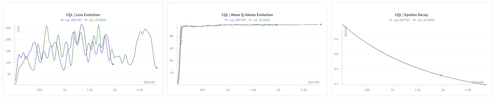

CQL training exhibited several notable characteristics. The loss function demonstrates high instability throughout training, with significant fluctuations making it difficult to observe clear convergence patterns. The Mean Q Values converge to a high value near 100, suggesting that the Q-network is learning to estimate large future rewards, potentially indicating optimistic value estimates or issues with reward scaling.

Training was performed with a batch size of 16, which constrained the algorithm to only 2,500 episodes within the 6-hour time limit. This limited training budget, combined with the computational constraints of the centralized critic processing information from all agents simultaneously, likely prevented the algorithm from reaching full convergence. The centralized approach requires significantly more computation per update compared to independent learners.

Notably, the results show no significant difference between the two reward functions tested (ShapedRewardFn and ProductionWeightedTerritoryRewardFn), suggesting that CQL's learning dynamics were more influenced by the algorithm's architecture and sample efficiency issues rather than the specific reward shaping. Overall, CQL demonstrates poor performance metrics in territory control, strength management, and production efficiency.

##### Independent Q-Learning (IQL)

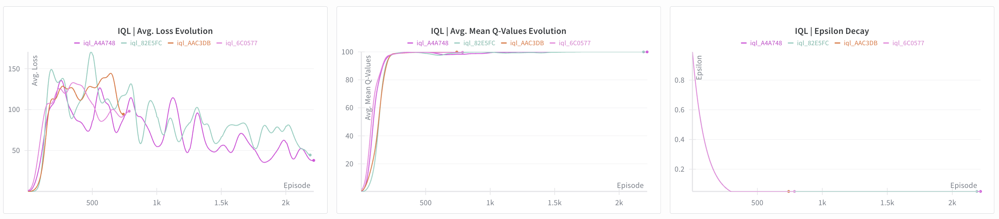

IQL training shows a distinctive learning pattern where the Average Loss initially increases before decreasing slowly over time. This pattern suggests that the agents initially struggle with the multi-agent environment's non-stationarity, as each agent's policy changes simultaneously, creating a moving target for the Q-function estimates. As training progresses, the independent learners adapt to this changing environment, resulting in the observed slow decrease in loss.

The Average Mean Q Values are remarkably similar to those observed in CQL, converging to values near 100. This similarity suggests that both value-based methods learn similar value estimates for the environment, despite their different architectures (centralized vs. independent critics). The parameter sharing used in IQL (shared Q-network weights across agents) helps improve sample efficiency while maintaining the simplicity of independent learning.

Both reward functions (ShapedRewardFn and ProductionWeightedTerritoryRewardFn) produced comparable results, indicating that IQL's learning dynamics were robust to the specific reward formulation within the tested configurations. However, like CQL, IQL shows poor performance metrics overall, with limited improvements in territory, strength, and production control.

##### Independent Proximal Policy Optimization (IPPO)

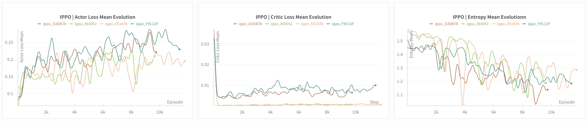

IPPO training reveals interesting dynamics in the actor-critic architecture. The Actor Loss Mean demonstrates a tendency to increase over time, which could indicate that the policy is becoming more deterministic (lower entropy) or that the advantage estimates are becoming more challenging as the agents learn. The Critic Loss Mean stabilizes close to zero, suggesting that the value function is learning accurate estimates of expected returns, which is crucial for stable policy gradient updates.

Despite these training dynamics, the win rate remains relatively small throughout training. However, observation of the metrics reveals slight improvements in expansion behavior.

The learned behavior shows a direct attack strategy targeting one of the enemies, demonstrating that the agents can learn basic combat tactics or basic expansion. The following GIF shows an example game from episode 9,500 (run `ippo_D3DB78`) against random bots, illustrating the direct attack behavior:

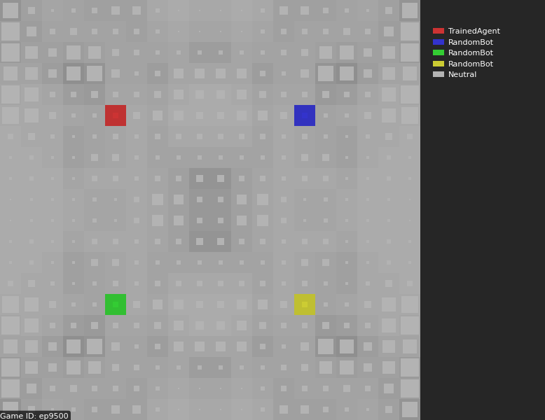

*IPPO agent behavior at episode 9,500 (run `ippo_D3DB78`) showing direct attack strategy against random bot opponents.*

##### Multi-Agent Proximal Policy Optimization (MAPPO)

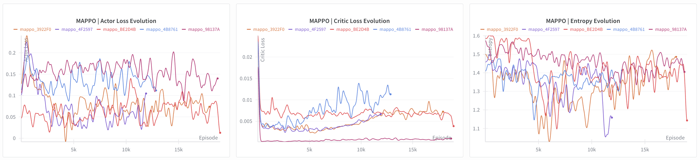

**Reward Ablation Study**: A comprehensive reward ablation study was conducted for MAPPO, comparing three reward configurations: **MinimalReward** (sparse rewards: +1 for winner, 0 otherwise), **ShapedRewardFn** (dense composite rewards), and **CurriculumShapedRewardFn** (curriculum learning blending shaped and minimal rewards over time).

The results clearly show that the minimal reward configuration achieves better performance than the other algorithms (CQL, IQL, IPPO), but the shaped reward significantly outperforms it. This highlights the importance of reward shaping in complex multi-agent environments, where dense rewards provide more informative learning signals for coordinating territorial control, resource management, and strategic expansion.

The curriculum shaped reward reveals an interesting degradation pattern: as the curriculum schedule transitions from shaped rewards (early training) to minimal rewards (late training), the metrics degrade from the levels achieved with pure shaped rewards toward the levels achieved with minimal rewards. This suggests that while curriculum learning can be beneficial in some settings, in this case the shaped rewards provide essential guidance that, when removed, leads to performance regression. Maybe the guidance was removed too early.

Multiple training runs with different random seeds were conducted to **study variance**, and the results show low variance in the evolution of metrics. For example, two separate runs of the curriculum shaped reward configuration exhibit consistent learning trajectories, indicating stable and reproducible learning dynamics.

Both the shaped reward and production-weighted territory reward achieve similar results and outperform the rest of the algorithms tested. This demonstrates that MAPPO's centralized critic architecture, combined with appropriate reward shaping, enables effective learning of coordinated multi-agent strategies.

The baseline evaluation dashboard for the MAPPO agent (run `mappo_98137A`) provides comprehensive proof of its expansive intelligence and strategic capabilities:

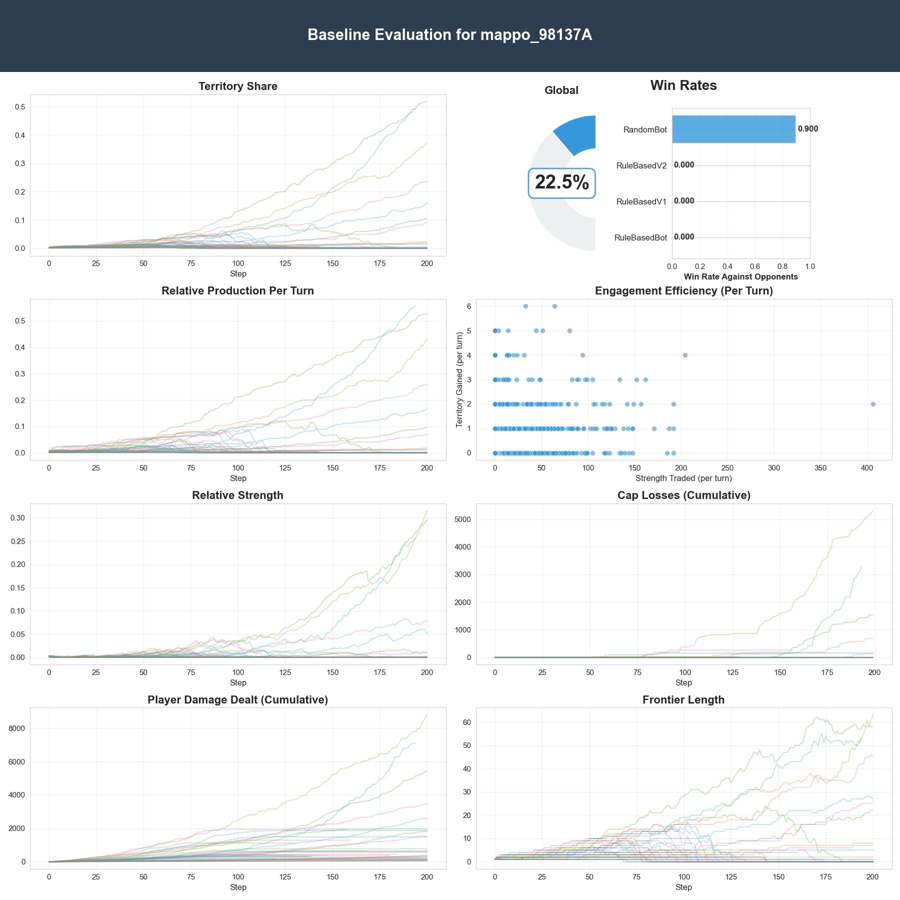

*Baseline evaluation dashboard for MAPPO (run `mappo_98137A`)..*

The evaluation reveals that MAPPO achieves a **90% win rate against RandomBot** and proving a proof of its expanding intelligence.

The following GIF shows an example game from episode 18,000 (run `mappo_98137A`) against random bots, demonstrating learned strategic behavior:

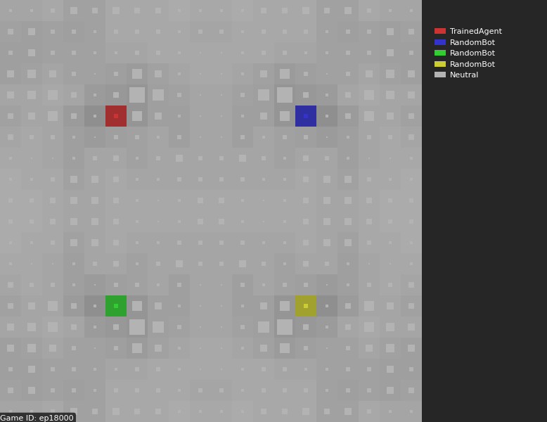

*MAPPO agent behavior at episode 18,000 (run `mappo_98137A`) showing strategic expansion and waiting behavior against random bot opponents.*

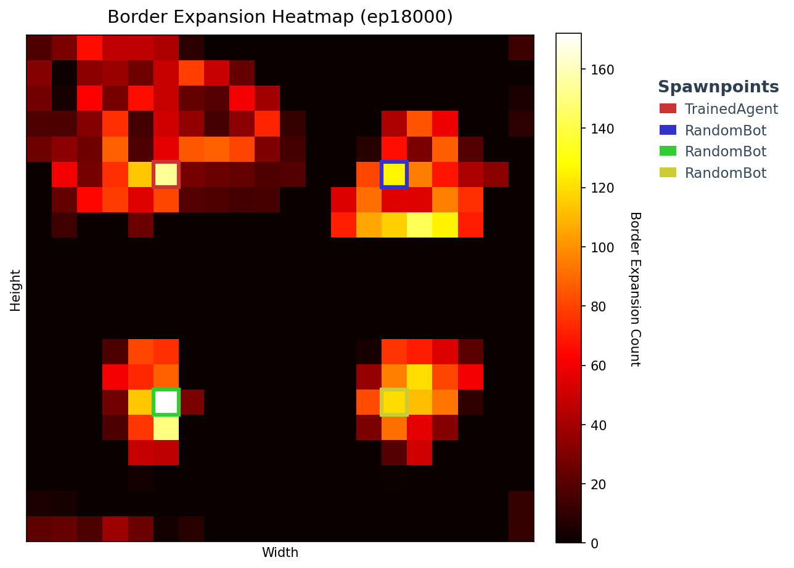

The observed behavior demonstrates clever expansion tactics, including strategic waiting before expanding into new territory. However, the agents have not yet learned sophisticated attack strategies or efficient inner cell combination mechanisms. Using the official Halite visualizer, one can observe many unnecessary cell moves with strength = 0, indicating that the agents still have room for improvement in optimizing movement efficiency and force coordination.

##### Global Results Comparison

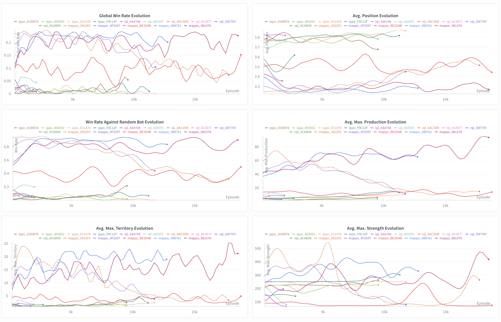

The global results comparison across all algorithms reveals clear performance hierarchies. MAPPO with shaped or production-weighted rewards achieves the best performance, demonstrating the benefits of centralized value estimation combined with decentralized policy execution, achieving a perfect win rate against random bots. IPPO shows low performance but an observable learning in strategic metrics. The value-based methods (CQL and IQL) show similar Q-value convergence patterns but face challenges with sample efficiency and training stability, particularly CQL's high loss variance, resulting in poor performance metrics overall.

The comparison highlights the importance of both algorithm architecture (centralized vs. independent, value-based vs. policy gradient) and reward design (shaped vs. minimal) in achieving effective multi-agent learning in complex strategic environments like Halite. However, it is important to note that these performance improvements are limited to random bot opponents; none of the trained agents have been able to defeat the rule-based bots, highlighting the significant challenge that strategic opponents pose to learned policies.

---

### 7. Conclusions and Further Work

#### 7.1 Conclusions

This project demonstrates that **Multi-Agent Reinforcement Learning (MARL) is a feasible approach for training agents in complex strategic games like Halite**, but it requires significantly higher computational resources than were available for these experiments. The limited training time (6-hour time limits) constrained the number of episodes that could be completed, potentially impacting convergence and final performance.

**Key Findings:**

1. **Algorithm Architecture Matters**: Centralized training with decentralized execution (MAPPO) significantly outperforms fully independent learning approaches (IQL, IPPO, CQL). The centralized critic provides better value estimates that help agents learn coordinated strategies, while maintaining scalability through decentralized action selection.

2. **Reward Shaping is Critical**: The reward ablation study clearly demonstrates that dense reward shaping (ShapedRewardFn, ProductionWeightedTerritoryRewardFn) is essential for effective learning in this environment. Minimal sparse rewards lead to inferior performance, and curriculum learning that transitions from shaped to minimal rewards actually degrades performance, suggesting that the shaped rewards provide necessary guidance throughout training.

3. **Policy Gradient Methods Outperform Value-Based Methods**: MAPPO and IPPO (policy gradient algorithms) show better learning dynamics and performance compared to CQL and IQL (value-based methods). Value-based methods struggled with training stability, sample efficiency, and non-stationarity issues in this multi-agent setting.

4. **Local Observations Enable Scalability**: The use of 7×7 local observation patches instead of global observations reduces computational complexity while still allowing agents to learn effective strategies, making the approach more scalable to larger grid sizes.

5. **Performance Gap with Strategic Opponents**: While MAPPO achieves almost perfect win rates against random bots and demonstrates learned strategic behaviors (expansion intelligence), all trained agents fail against rule-based bots with strategic decision-making capabilities. This highlights the gap between learned policies and expert-designed strategies.

6. **Behavioral Observations**: The trained agents learn fundamental strategic concepts such as territorial expansion. However, they lack sophisticated attack coordination, efficient movement patterns (many unnecessary zero-strength moves), and strategic inner cell combination mechanisms observed in rule-based bots.

#### 7.2 Further Work

Several directions could improve the performance and capabilities of learned agents:

**Computational Resources and Training**
- **Extended Training**: Increase training time and episode budgets to allow algorithms to reach full convergence. The current 6-hour limits with constrained episodes prevented complete learning.
- **Hyperparameter Optimization**: Systematic hyperparameter search for learning rates, network architectures, batch sizes, and update frequencies could improve sample efficiency and final performance.
- **Larger Scale Experiments**: Test scalability on larger grid sizes (30×30, 40×40) and with more agents (6-8 players) to evaluate generalization capabilities.

**Algorithm Improvement**
- **Enhanced Exploration**: Investigate advanced exploration strategies (curiosity-driven exploration, intrinsic motivation) to improve discovery of strategic patterns and reduce suboptimal behavior.
- **Communication Mechanisms**: Investigate explicit or implicit communication protocols between agents to enable better coordination and strategic planning.

**Reward Engineering**
- **Advanced Reward Shaping**: Develop more sophisticated reward functions that better capture long-term strategic value, encourage efficient movement patterns, and penalize wasteful actions more effectively.
- **Self-Play Training**: Train agents against increasingly skilled versions of themselves to gradually improve strategic capabilities.
- **Curriculum Learning Refinement**: Design better curriculum schedules that maintain performance while transitioning to more challenging reward structures.

**Defeating Strategic Opponents**
- **Adversarial Training**: Train agents specifically against rule-based bots to learn counter-strategies and defensive mechanisms.

The results demonstrate promising progress in applying MARL to complex strategic games, but significant work remains to bridge the gap between learned policies and expert-designed strategies, particularly in competitive multi-agent scenarios.
